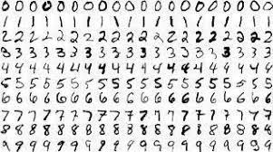
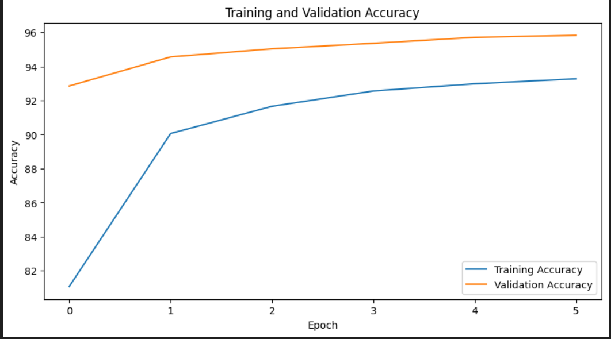
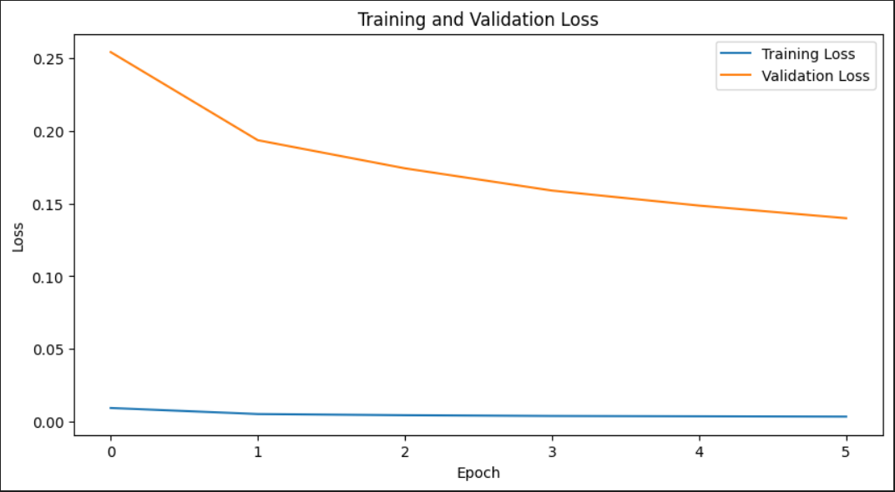
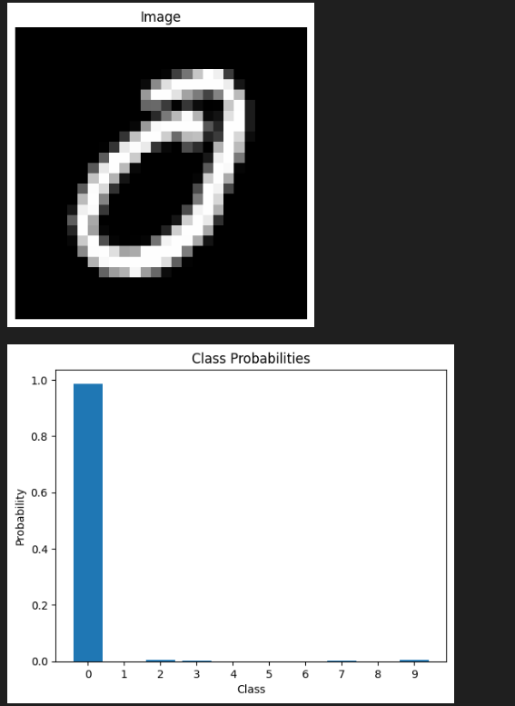

# Handwritten Digit Classification using PyTorch



## Overview

This project is a machine learning model for handwritten digit classification, employing PyTorch to achieve superior results on the MNIST dataset. The primary objective is to construct and train a fully connected neural network capable of accurately identifying and categorizing handwritten digits (0-9).

## Project Components

- [Jupyter Notebook](notebook.ipynb): Comprehensive codebase encapsulating the project.
- [Pre-trained Model Weights](model.pth): Pre-trained model weights, enabling immediate use and further experimentation.

## Results and Insights

### Validation and training Accuracy



The model exhibits an impressive validation accuracy of 96 percent on the MNIST dataset, demonstrating its robustness in digit recognition tasks.

### Loss



The validation loss graph illustrates the model's continuous learning progress during training, indicative of its adaptability and efficiency.

**Sample Test Result**:



The image above shows a sample test result where the model correctly classified a handwritten digit as "0".

## Getting Started

1. **Clone the Repository**:
   ```bash
   git clone https://github.com/Afras99/Handwritten_Digit_Classification_using_PyTorch.git
   cd Handwritten_Digit_Classification_using_PyTorch
